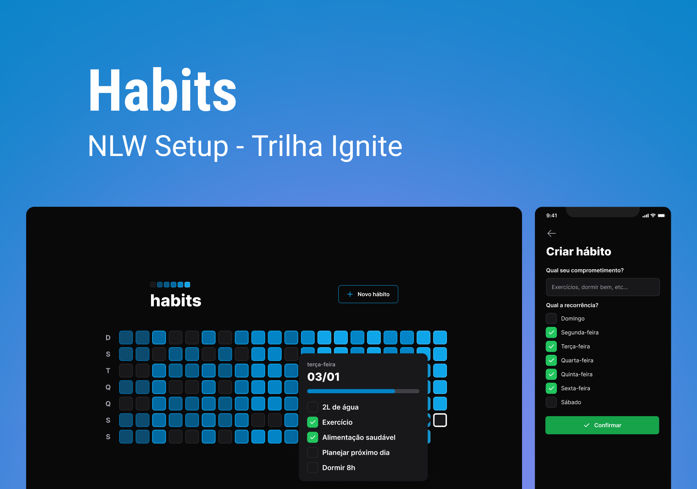

<p align="center">
  
</p>

---

## 💻 Sobre o projeto

O Habits foi desenvolvido durante o evento NLW Setup - Trilha Ignite da Rocketseat. A aplicação serve para o monitoramento de hábitos diários para auxiliar os usúarios na admistração/organização dos mesmos.

No Habits, o usúario pode criar hábitos, editar o status (concluído/não-concluído) dos hábitos e acompanhar todo o progresso dos seus hábitos.

## 🛠️ Tecnologias

Este projeto foi desenvolvido utilizando as seguintes tecnologias:

- [ReactJS](https://reactjs.org/)
- [NodeJS](https://nodejs.org/en/)
- [React Native](https://reactnative.dev/)
- [TypeScript](https://www.typescriptlang.org/)
- [Tailwind CSS](https://tailwindcss.com/)
- [Radix UI](https://www.radix-ui.com/)
- [Prisma](https://www.prisma.io/)
- [Fastify](https://www.fastify.io/)
- [Expo](https://expo.dev/)
- [ViteJS](https://vitejs.dev/)

## 🚀 Iniciando

**Clone o projeto**

```bash
git clone https://github.com/sampaiocode/ignews.git
```

**Siga os passos abaixo**

### Web

```bash
# Acesse a pasta
$ cd web

# Instale as dependências
$ npm install

# Inicie a aplicação
$ npm run dev
```

### Server

```bash
# Acesse a pasta
$ cd server

# Instale as dependências
$ npm install

# Inicie a aplicação
$ npm run dev
```

### Mobile

```bash
# Acesse a pasta
$ cd mobile

# Instale as dependências
$ npm install

# Inicie a aplicação
$ npm start
```

## 📝 Licença

Esse projeto está sob licença. Veja o arquivo [LICENÇA](LICENSE) para mais detalhes.

---

Desenvolvido com 💙 por [Deivit Eduardo](https://github.com/sampaiocode)
